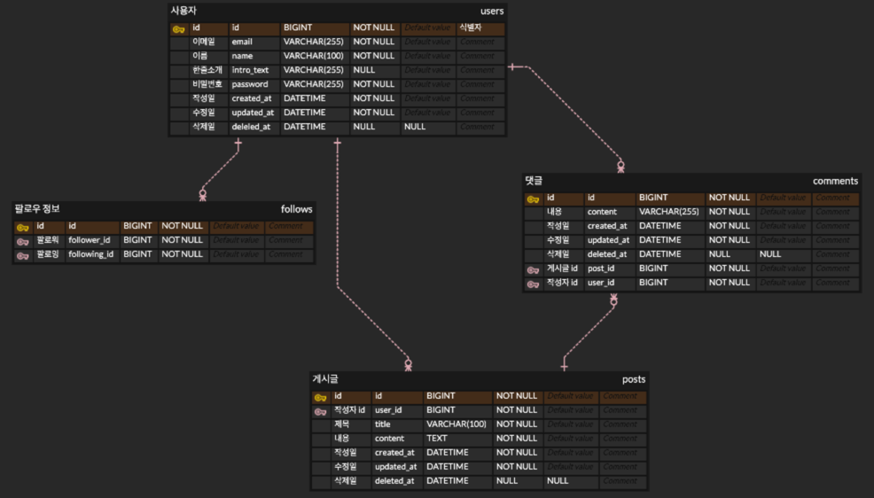

# 뉴스피드 서비스: 실시간 소셜 피드 플랫폼

## 프로젝트 소개

이 프로젝트는 실시간으로 업데이트되는 뉴스피드를 제공하는 소셜 플랫폼입니다. 사용자는 게시물을 작성하고, 댓글을 달며, 다른 사용자를 팔로우할 수 있습니다. 또한, 팔로우한 사용자의 게시물을 실시간으로 확인할 수 있습니다.

## 목차
1. [주요 기능](##주요 기능)
2. [ERD](#erd)
3. [API 명세서](#api-명세서)

## 주요 기능

### 사용자 관리
- 회원가입 및 로그인
- 프로필 수정 및 비밀번호 변경
- 회원 탈퇴

### 게시물 관리
- 게시물 작성, 수정, 삭제
- 게시물 목록 조회 (전체 게시물 및 팔로우한 사용자의 게시물)

### 댓글 관리
- 댓글 작성, 수정, 삭제
- 게시물별 댓글 목록 조회

### 팔로우 관리
- 다른 사용자 팔로우 및 언팔로우
- 팔로워 및 팔로잉 목록 조회

### 인증 및 권한 관리
- 세션 기반 인증
- 접근 권한 검증

## ERD

## API 명세서
노션에서 보기: https://teamsparta.notion.site/f554439b8e1341c49336993320c79d95?v=0a525dae52d44380822b40163d71840d

| 기능 | Method | URI | Request | Response |
|------|--------|-----|---------|----------|
| 사용자 프로필 단건 조회 | GET | /api/users/{userId} | - | `{ "id": 1, "name": "newbie updated", "email": "temp@gmail.com", "introText": "intro text", "followerCount": 0, "followingCount": 0 }` |
| 프로필 수정 | PUT | /api/users | `{ "name": "updated_name", "introText": "hello" }` | - |
| 비밀번호 수정 | PUT | /api/users/password | `{ "currentPassword": "password1234!", "newPassword": "newPassword1234!" }` | - |
| 게시글 작성 | POST | /api/posts | `{ "title": "헬로", "content": "안녕하세요" }` | `{ "id": 1, "title": "헬로", "content": "안녕하세요", "userName": "테스트", "commentCount": 0, "createdAt": "2025-02-19T13:32:30.393461", "updatedAt": "2025-02-19T13:32:30.393461" }` |
| 게시글 조회 (단건) | GET | /api/posts/{postId} | - | `{ "id": 1, "title": "헬로", "content": "안녕하세요", "userName": "테스트", "commentCount": 0, "createdAt": "2025-02-19T13:32:30.393461", "updatedAt": "2025-02-19T13:32:30.393461" }` |
| 사용자 게시글 조회 (다건) | GET | /api/posts?userId={userId}&size={size}&page={page} | - | `{ "data": [{ "id": 1, "title": "헬로", "content": "안녕하세요", "userName": "테스트", "commentCount": 0, "createdAt": "2025-02-19T13:32:30", "updatedAt": "2025-02-19T13:32:30" }], "pagination": { "currentPage": 0, "totalPages": 1, "totalElements": 1, "size": 20 } }` |
| 게시글 수정 | PUT | /api/posts/{postId} | `{ "title": "헬로 (수정)", "content": "헬로 (수정)" }` | `{ "id": 4, "title": "헬로 (수정)", "content": "헬로 (수정)", "userName": "테스트", "createdAt": "2025-02-18T23:06:30", "updatedAt": "2025-02-18T23:06:30" }` |
| 게시글 삭제 | DELETE | /api/posts/{postId} | - | - |
| 회원가입 | POST | /api/users/register | `{ "email": "temp@gmail.com", "password": "password1234!", "name": "newbie" }` | `200 OK` |
| 회원탈퇴 | POST | /api/users/withdraw | `{ "password": "password1234!" }` | `200 OK` |
| 로그인 | POST | /api/auth/login | `{ "email": "temp@gmail.com", "password": "password1234!" }` | `200 OK { "userId": 1 }` |
| 로그아웃 | POST | /api/auth/logout | - | `200 OK` |
| 팔로우 추가 | POST | /api/follow/{targetUserId} | - | `200 OK` |
| 팔로우 취소 | DELETE | /api/follow/{targetUserId} | - | `200 OK` |
| 사용자의 팔로워 조회 | GET | /api/follow/{userId}/followers | 예시: `/api/follow/1/followers` | `{ "data": [{ "userId": 1, "userName": "테스트" }], "pagination": { "currentPage": 0, "totalPages": 1, "totalElements": 1, "size": 20 } }` |
| 사용자가 팔로우 중인 사람 조회 | GET | /api/follow/{userId}/following | 예시: `/api/follow/2/following` | `{ "data": [{ "userId": 1, "userName": "테스트" }], "pagination": { "currentPage": 0, "totalPages": 1, "totalElements": 1, "size": 20 } }` |
| 친구 게시글 조회 (다건) | GET | /api/posts/following?size={size}&page={page} | 예시: `/api/posts/following?size=2` | `{ "data": [{ "id": 4, "title": "헬로3", "content": "안녕하세요", "userName": "테스트3", "commentCount": 0, "createdAt": "2025-02-19T15:16:16", "updatedAt": "2025-02-19T15:16:16" }, { "id": 3, "title": "헬로", "content": "안녕하세요", "userName": "테스트2", "commentCount": 0, "createdAt": "2025-02-19T15:16:01", "updatedAt": "2025-02-19T15:16:01" }], "pagination": { "currentPage": 0, "totalPages": 2, "totalElements": 3, "size": 2 } }` |
| 댓글 작성 | POST | /api/posts/{postId}/comments | `{ "content": "댓글 내용" }` | `{ "id": 1, "userId": 5, "postId": 3, "content": "댓글 내용" }` |
| 댓글 조회 (다건) | GET | /api/posts/{postId}/comments | 예시: `/api/posts/3/comments` | `{ "data": [{ "id": 1, "content": "댓글 내용", "postId": 3, "userName": null, "createdAt": "2025-02-19T14:57:39.047373", "updatedAt": "2025-02-19T14:57:39.047373", "isDeleted": true }, { "id": 2, "content": "댓글 내용 2", "postId": 3, "userName": "테스트4", "createdAt": "2025-02-19T15:35:59.908764", "updatedAt": "2025-02-19T15:35:59.908764", "isDeleted": false }], "pagination": { "currentPage": 0, "totalPages": 1, "totalElements": 2, "size": 20 } }` |
| 댓글 수정 | PUT | /api/posts/{postId}/comments/{commentId} | `{ "content": "변경된 댓글" }` | `{ "id": 2, "content": "변경된 댓글" }` |
| 댓글 삭제 | DELETE | /api/posts/{postId}/comments/{commentId} | 예시: `/api/posts/3/comments/1` | `200 OK` |
| 사용자 프로필 다건 조회 | GET | /api/users | - | `[ { "id": 1, "name": "newbie", "email": "temp@gmail.com", "introText": null, "followerCount": null, "followingCount": null } ]` |
